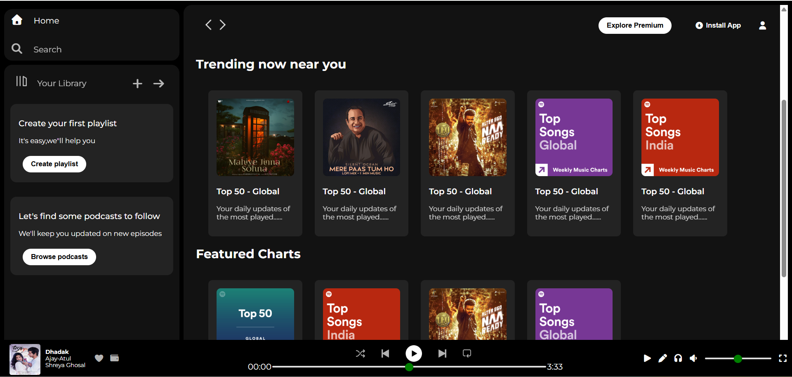

# 🎵 Spotify Clone (HTML & CSS)

A **Spotify Clone web page** created using **pure HTML and CSS**.  
This project focuses on recreating the **Spotify UI layout**, styling, and responsiveness without using JavaScript.

---

## 🚀 Features

- 🎧 Spotify-inspired UI design
- 🎨 Modern CSS styling
- 📂 Clean and simple structure
- ❌ No JavaScript used

---

## 🛠️ Technologies Used

- **HTML5** – Page structure  
- **CSS3** – Styling, layout, and responsiveness  

---

## 📸 Project Preview

